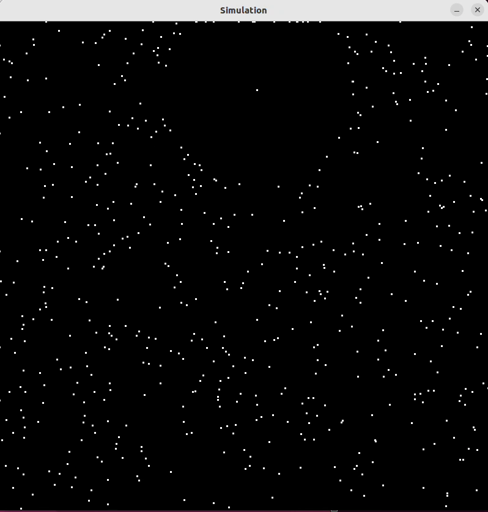

Particle Simulation with MPI and SDL
Description
This repository contains a particle simulation application implemented using MPI for parallel processing and SDL for rendering. The simulation models the behavior of particles within a defined space, using the Barnes-Hut algorithm for efficient computation of particle interactions.

Features
MPI-based parallel computation for efficient simulation of large particle systems.
SDL-based graphical representation of particles.
Configurable simulation parameters such as boundary size, particle count, and simulation steps.
Prerequisites
Before you start, ensure you have the following installed:

An MPI implementation (e.g., MPICH, OpenMPI)
SDL2 library
C++ compiler (e.g., GCC)
Installation
Cloning the Repository
To clone the repository, run:

git clone https://github.com/HTrinh43/barnes-hut-galaxy-simulator.git
cd barnes-hut-galaxy-simulator

Building the Application
To build the application, run:

mpicxx -o nbody src/mpi.cpp src/body.cpp src/io.cpp src/node.cpp $(sdl2-config --cflags --libs)

Usage
To run the simulation, use the following command:

mpiexec -n <number_of_processes> ./nbody -i <input_file> -o <output_file> -s <steps> -t <theta> -d <delta_time> [-V] [-p]

<number_of_processes>: Number of MPI processes to use.
<input_file>: Path to the input file containing initial particle states.
<output_file>: Path to save the simulation output.
<steps>: Number of simulation steps.
<theta>: Threshold value for the Barnes-Hut algorithm.
<delta_time>: Time step for the simulation.
-V: (Optional) Enable visualization with SDL.
-p: (Optional) Enable printing of particle states.

Contributing
Contributions to this project are welcome. Please follow these steps:

Fork the repository.
Create a new branch for your feature (git checkout -b feature/AmazingFeature).
Commit your changes (git commit -m 'Add some AmazingFeature').
Push to the branch (git push origin feature/AmazingFeature).
Open a pull request.
